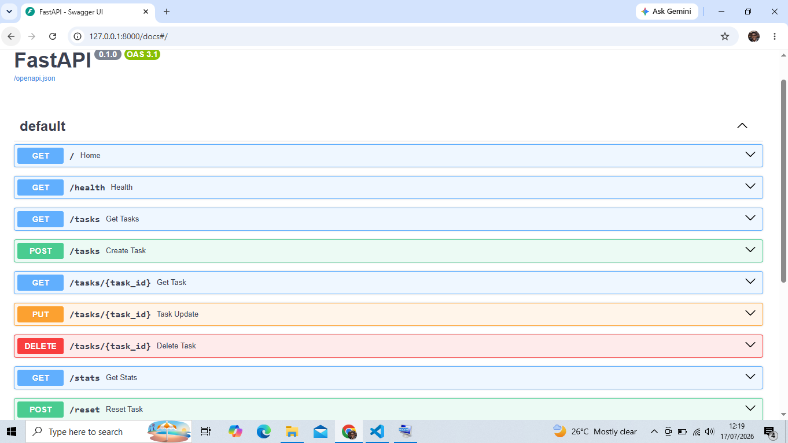

# Task CRUD API

## Description

This is a simple CRUD (Create, Read, Update, Delete) REST API built with FastAPI. It allows users to create, view, update, and delete tasks stored in memory.

## Features

- Create a task
- Read tasks
- Update a task
- Delete a task
- Search a task using query parameter
- View task statistics
- Health check endpoint
- Reset endpoint
- Interactive Swagger documentation

## Mortality Experiment

After restarting the FastAPI server, all tasks returned to their original state because the application stores data in memory instead of a database. Any changes made while the server was running were lost when it restarted.

## Installation

Install the required packages:

```bash
pip install -r requirements.txt
```

## Run the API

```bash
python -m uvicorn main:app --reload
```

Then open:

- http://127.0.0.1:8000
- Swagger UI: http://127.0.0.1:8000/docs

## API Endpoints

| Method | Endpoint | Description |
|--------|----------|-------------|
| GET | / | API information |
| GET | /health | Health check |
| GET | /tasks | Get all tasks |
| GET | /tasks?search=Build | Search tasks |
| GET | /tasks/{task_id} | Get one task |
| POST | /tasks | Create a task |
| PUT | /tasks/{task_id} | Update a task |
| DELETE | /tasks/{task_id} | Delete a task |

## Sample curl Command

```bash
curl -i http://127.0.0.1:8000/tasks
```

## Swagger UI


http://127.0.0.1:8000/docs

## Persistence Verification
Started the stack with `docker compose up --build`.
Created a task via `POST /tasks`.
Confirmed it existed via `GET /tasks`.
Ran `docker compose down` (containers stopped and removed, volume preserved).
Ran `docker compose up` to restart the stack.
Ran `GET /tasks` again — the previously created task was still present, confirming data survives an app + container restart.

## Architecture Note
The in-memory repository was replaced with a PostgreSQL-backed repository (`repository.py`).
The service and route logic in `main.py` did not change in shape — only the data access layer was swapped, proving the separation between routes/service and storage.